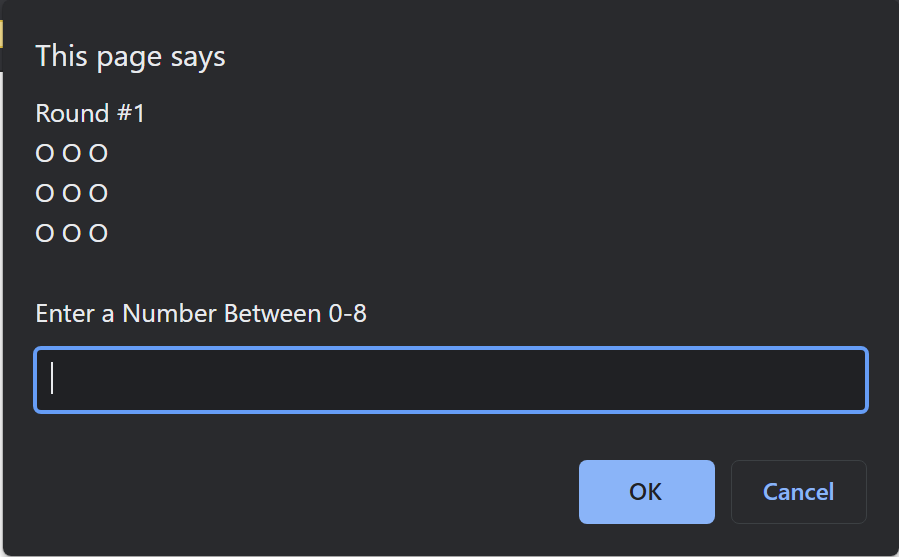

# Javascript Battleship Game

A Battleship Game

## Screenshots

### Desktop

## How to set up this repo or run the repo:

1. clone this repository
2. click index.html and open in browser
3. Battleship game begins
4. Guess and enter the number from 0-8
5. 'HIT' symbol is 1 and 'MISSED' symbol is X
6. Sink all the ship to win the game

## Built With

- HTML5, Javascript

## Authors

- **Prakriti Rajbhandari** - [PrakritiRajbhandari](https://github.com/PrakritiRajbhandari)
